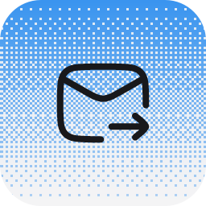

<p align="center">
  <picture>
    <source media="(prefers-color-scheme: dark)" srcset="./icon-dark.png" />
    
  </picture>
</p>

<div align="center">

# Outreach

</div>

A small-batch campaign workspace from audience brief to reviewed draft to explicit send through an existing Ryu Mail inbox.

> **The public home of `ryu-outreach`.** Source, builds, and releases live here —
> binaries for every platform are attached to each release.
>
> This tree is generated from the Ryu monorepo, so commits pushed here
> directly are replaced on the next sync. **Pull requests are welcome** —
> open them here and they are ported into the monorepo, then flow back out.
> Ryu as a whole: https://github.com/amajorai/ryu

## Install

**App:** [Install](ryu://apps/@ryu/outreach) (opens the Ryu desktop app and asks you to confirm)

**CLI:**

```bash
ryu apps add @ryu/outreach
```

## Source & build

This is the **source of record** for the app UI. It imports Ryu's private
`@ryu/ui` design system, so it does **not** build standalone outside the
monorepo — it **builds inside the amajorai/ryu monorepo workspace**.
The **shipped bundle below is the built artifact**: a prebuilt single-file
companion bundle is included at [`dist/outreach.ui.html`](./dist/outreach.ui.html) —
the runnable UI Ryu loads for this app.

## License

Apache-2.0 — see [LICENSE](./LICENSE).

## Ryu primitives used

- `storage:kv` stores the app's versioned campaign state in the app's tenant
  namespace.
- `hook:side-model` calls the shared Ryu model bridge for draft suggestions. The
  app never calls a provider URL directly.
- `mail:crud` lists existing Ryu Mail inboxes and sends one selected recipient at
  a time after the user reviews the message.
- `core:list_agents` reads the shared, secret-free runtime catalog so the UI can
  show the node's current model lane.
- `shell:integrate` keeps the companion on the host's live theme; `ui:toast`
  provides short operation feedback.
- `RyuAppShell` and the shared `@ryu/ui` controls provide the app UI contract.

When no host bridge is available, the companion renders a clearly labeled demo
workspace. Demo sends update in-memory preview state and never contact a real
recipient.

When a host bridge is present, an empty storage response starts with an empty
node-owned campaign workspace. The live path never seeds the demo campaign or
reports a preview send as a delivered message.

## Mesh LLM

Mesh LLM is not modeled as a second Ryu App. It is an OpenAI-compatible local
inference runtime, so Outreach uses it through Ryu's existing model bridge. The
Ryu Core engine catalog now includes an opt-in `mesh-llm` local engine on port
`9337` (profile-shifted for dev/canary profiles). Once Mesh LLM is active in
Ryu's Engines section, enter the exact model id returned by
`http://127.0.0.1:9337/v1/models` in Outreach's **Mesh LLM model id** field.
Leaving that field blank uses the node's normal model selection.

Ryu starts Mesh LLM with its own configuration and `serve --headless`; it does
not join a public mesh or download a model without the user choosing that engine.
An externally started Mesh LLM server can be adopted when it is listening on the
active profile port. See the public engine guide for installation and operating
notes.

## Build and test

```sh
bun run --cwd apps-store/outreach/ui test
bun run --cwd apps-store/outreach/ui check-types
bun run --cwd apps-store/outreach/ui build
```

The UI build emits one self-contained `dist/index.html` for the sandboxed
Companion host.
